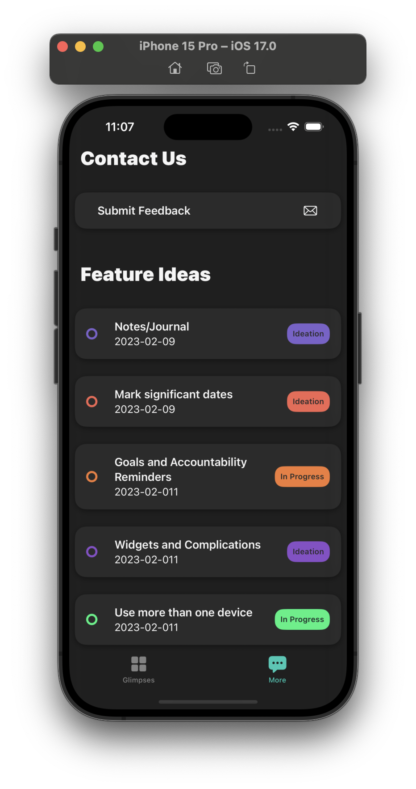
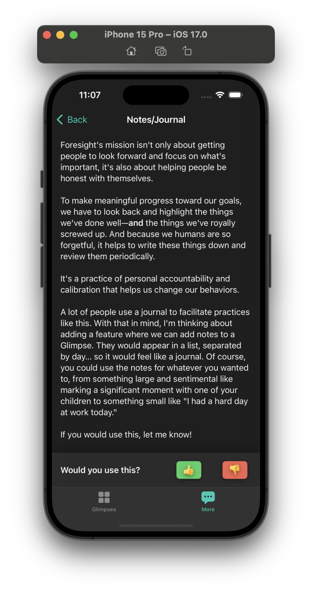
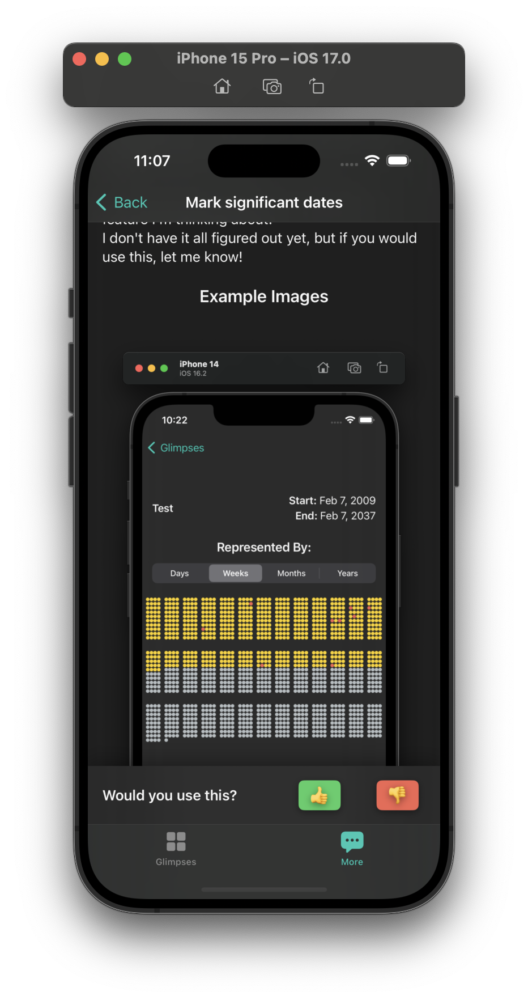

# Validation
Gather feedback on feature ideas so you can spend time working on what user actually want. 

## How does is work?

Validation is a UI as a Service. If you supply the URL to fetch the data from, we'll display it for you and make it easy to gather simple Positive, Negative feedback on your ideas. 

## What does it look like?

|Main Screen|Detail|With Images|
|:--:|:--:|:--:|
||||

## TODO List

- [] Initial release
    - [x] UI
        - [x] Gather Feedback Screen
            - [x] Email?
            - [x] Feature List
        - [x] Detail Screen
    - [x] Simple repository with opinionated networking stack
    - [x] Handling feedback is sole responsibility of the consumer
    - [x] TESTS
        - [x] Unit
        - [x] Snapshot
    - [] Swagger Docs
    - [] Docs and examples (use static json to represent your features)
    - [x] Demo app
- [] Inject Configuration
    - [] Allow strings, images, tints, etc., to be injected for greater UI customization
- [] Opinionated Handle Feedback
    - [] Can Handle feedback to a given URL
    - [] Swagger Docs
- [] On device cacheing
    - [] On device cache with load on network failure
    - [] Keep local record of feedback status and display that in the UI
- [] Saas
    - [] Allow consumers to subscribe to get an API key and use our own servers to host the data and accept the feedback.
    - [] A nice admin app to use with it
